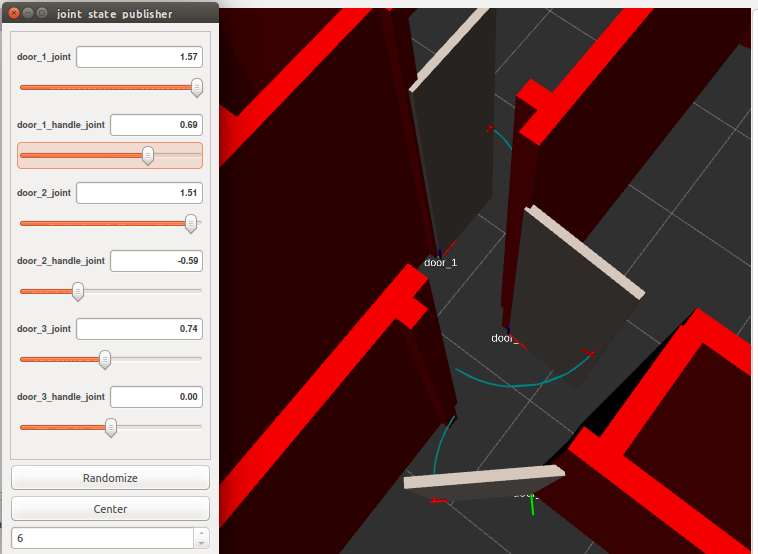
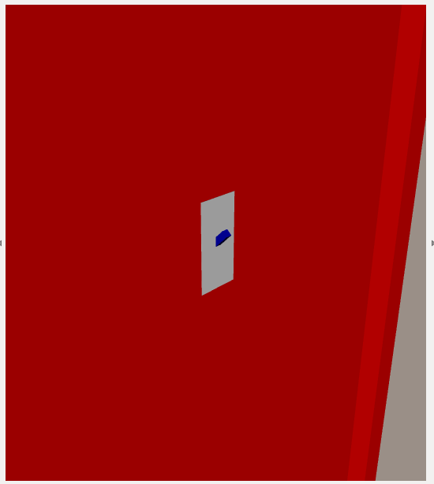

# Construction Manipulation Environment (CME)
Project name is just random, helpful with package organization.

More documentation can be found in [cme_docs](cme_docs/docs).

## Quickstart
### Installation/setup
```
mkdir -p ~/cme_ws/src
cd ~/cme_ws/src
git clone git+ssh://git@github.com/MyNameIsCosmo/kkim_cme.git
bash kkim_cme/bootstrap_ws.sh
```

### Full Simulation
Simulate the world and a robot with Gazebo.  
Launches Gazebo, RVIZ, door controls, a robot, and door controls.
```
source ~/cme_ws/devel/setup.bash
roslaunch cme_launch full.launch gazebo:=true rviz:=true robot:=husky
```

#### Running gmapping
```
roslaunch cme_launch gmapping.launch robot:=husky
```

#### Running exploration
```
roslaunch cme_lanuch exploration.launch
```

#### Running keyboard teleop
```
rosrun teleop_twist_keyboard teleop_twist_keyboard.py
```

### World Simulation
Simulate the world with Gazebo.  
Launches Gazebo, RVIZ, door controls
```
source ~/cme_ws/devel/setup.bash
roslaunch cme_launch test_gazebo.launch

./test_doors.sh
```

#### Husky Simulation
Simulate a Husky with Gazebo.  
Launches Gazebo, RVIZ, ACML
```
roslaunch cme_launch husky.launch
```

## Individual Robot Packages

### Clearpath Husky
```
roslaunch cme_launch husky.launch
```

### Clearpath Jackal
TODO

### Neobotix MM400
TODO

### Kinova Gen 3 Lite
```
roslaunch kortex_gazebo spawn_kortex_robot.launch use_trajectory_controller:=true
```

### Pilz
TODO

## Tasks
Overview of xacro file at [complete_model.urdf.xacro](cme_description/urdf/complete_model.urdf.xacro).

### Doors
Doors are created using a xacro macro defined in [door.xacro.xml](cme_description/urdf/door.xacro.xml).  
Documentation on usage available in the door xacro document.



### Light Switches
Light switches are created using a xacro macro defined in [light_switch.xacro.xml](cme_description/urdf/light_switch.xacro.xml).



## Todo
- [x] Organize packages and dependencies
- [x] Add door xacro
- [x] Add light xacro
- [x] Joint controller for door/lights
- [x] Fix gazebo values
- [x] Service to open/close door
	- [x] Use `rostopic pub -1 /door_1_position/command std_msgs/Float64 "data: 1.0"`
- [ ] Service to turn light on/off
- [ ] Template robot actions
	- [ ] Create navigation action
	- [ ] Create manipulation action
	- [ ] Create door open action
	- [ ] Create light switch action
- [ ] Husky + Kinova gen3 lite in simulation
- [ ] MM400 + Panda in simulation
- [ ] Verify gravity/collision checks
- [ ] Robot navigation around map
- [ ] Robot manipulator movement
- [ ] Manipulate to a given point (eg. door handle)
	- [ ] Move robot to closest point if out of reach
	- [ ] Collision check with manipulator
	- [ ] Interact with manipulator
- [ ] Cleanup packages (excess comments, default templates, etc)
- [ ] Finish documentation
